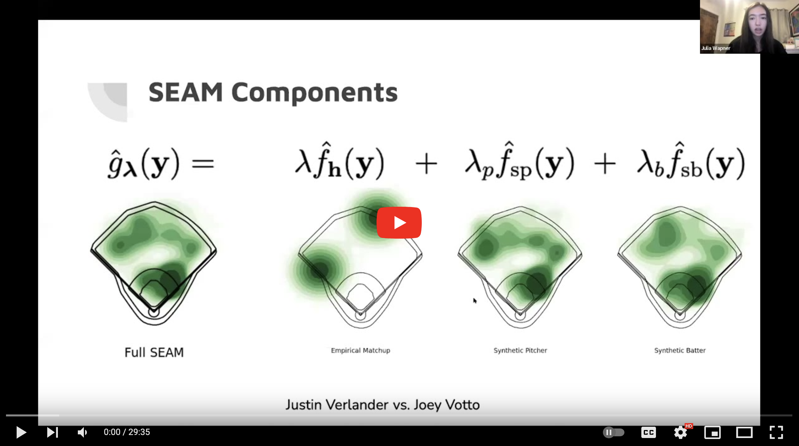
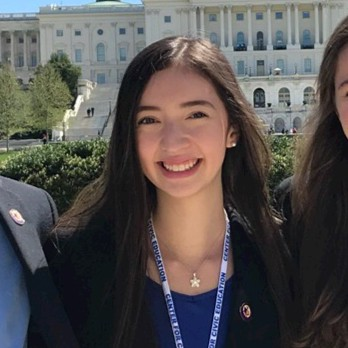
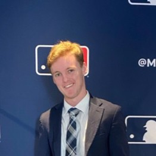

## Welcome 

Welcome to Eck Sports Lab! 

At Eck Sports Lab, our mission is to research all things sports with a current focus on baseball. We study topics ranging from player evaluation metrics to comparing baseball players across eras. The common thread linking all of our projects is a dedication to high-quality and often innovative statistical and interdisciplinary research with a focus on an accessible and entertaining presentation of our ideas. 

## News and Events

 - **05/29/25**: Our paper "Comparing baseball players across eras via novel Full House Modeling" has been published at Annals of Applied Statistics! [See here](https://projecteuclid.org/journals/annals-of-applied-statistics/volume-19/issue-2/Comparing-baseball-players-across-eras-via-novel-Full-House-Modeling/10.1214/24-AOAS1992.short). A preprint can be accessed [here](https://www.e-publications.org/ims/submission/AOAS/user/submissionFile/64774?confirm=94cf39e4).
 - **05/27/25**: Our era-adjusted WAR stat was featured by Foolish Baseball in his new tour de force video on Hank Aaron's unparalleled consistency. [See here](https://www.youtube.com/watch?v=k_3aAw5iY4k).
 - **03/25/25**: Version 2.1 of our [era-adjusted statistics website](https://eckeraadjustment.web.illinois.edu/#rankings) is now available. This version includes era-adjusted statistics through the 2024 season.
 - **01/21/25**: The fourth iteration of the STAT 430: Baseball Analytics class at University of Illinois Urbana-Champaign is underway.
 - **04/26/24**: Colin Alberts finished his Master's thesis on fielder placement optimization. See his GitHub repo [here](https://github.com/colalb1/SEAM-Fielder-Optimization).
 - **08/12/23**: Daniel Eck presented "Comparing baseball players across eras via the novel Full House Model" at [Saber Seminar 2023](https://www.saberseminar.com/).
 - **03/13/23**: Our era-adjusted methodology and interdisciplinary collaboration was [featured](https://stat.illinois.edu/news/2023-03-13/statistics-and-story-baseballs-two-languages) by the College of Liberal Arts and Sciences at University of Illinois Urbana-Champaign.
 - The Eck Sports Lab is collaborating with the Chicago Cubs on a joint undergraduate research mentorship program.

## Current Projects 

**Comparing baseball players across eras** - This is an ongoing project devoted to the development of statistical tools which can era-adjust performance metrics. The impetus for this project was the initial discovery that the current consensus of baseball ranking methods were biased towards the performance of pre-integration players. You can read more about these origins [here](https://deck13.shinyapps.io/challenging_baseball_nostalgia/?_ga=2.63424943.1066016428.1662040173-852280612.1656705949). Recently, we have made an advance towards the creation of era-adjusted statistics with the development of what we call [Full House Modeling](https://projecteuclid.org/journals/annals-of-applied-statistics/volume-19/issue-2/Comparing-baseball-players-across-eras-via-novel-Full-House-Modeling/10.1214/24-AOAS1992.short). Full House Models era-adjust statistics through a principled balancing of how players performed "vs. their peers" and the quality of the talent pool of players' contemporaries.

Here is a snapshot of our current results. Below is the top 10 list according to era-adjusted baseball reference wins above replacement (ebWAR) and era-adjusted fangraphs wins above replacement (efWAR):

rank | name | ebWAR | name | efWAR
| -- | ------- | ---- | ------ | ---- |
1  | Barry Bonds	| 154.71 | Barry Bonds	  | 145.57
2  | Willie Mays	| 145.30 | Roger Clemens  | 140.75
3  | Roger Clemens	| 144.38 | Willie Mays	  | 135.78
4  | Babe Ruth		| 138.64 | Henry Aaron	  | 127.96
5  | Henry Aaron	| 135.67 | Greg Maddux	  | 120.91
6  | Alex Rodriguez	| 120.64 | Babe Ruth	  | 120.6
7  | Stan Musial	| 119.37 | Stan Musial	  | 112.79
8  | Ty Cobb		| 115    | Alex Rodriguez | 110.52
9  | Greg Maddux	| 113.55 | Randy Johnson  | 109.78
10 | Albert Pujols	| 111.95 | Ty Cobb	  | 108.95

*The list above combines Babe Ruth's batting and pitching WAR*

Those interested in this project should check out [our website](https://eckeraadjustment.web.illinois.edu/#rankings). 

Listen to Daniel Eck and Adrian Burgos Jr.'s discuss our work on the [Effectively Wild podcast](https://podcasts.apple.com/us/podcast/effectively-wild-episode-1954-los-got-physical/id545919715?i=1000593873446) (Eck and Burgos appear at 53:34). Daniel Eck also discussed this work on the [Wharton Moneyball podcast](https://embed.acast.com/$/5b69f70c0a0eca0c20692176/11123-cfb-nfl-covid-mlb-eck-thompson) (Eck's appearance starts at 23:45)

 

**SEAM method for better batted-ball prediction** - We developed SEAM (synthetic estimated average matchup) methodology for describing batter versus pitcher matchups in baseball. The SEAM method provides confidence regions that reflect where baseballs that are put into play are expected to land. Our method is more accurate than similar methods constructed from individual batter spray charts or an individual pitcher's spray chart allowed. We estimate that the implementation of SEAM can yield an additional 40 outs over conventional spray charts throughout the course of an MLB season. We have developed a [web application](https://seam.stat.illinois.edu/index.html) that implements the SEAM method and provides visualizations. 

Check out Julia Wapner's presentation of the SEAM method at the 2022 SABR Analytics Conference:

 

## People 

    
    
<a href = "https://publish.illinois.edu/danieleck/">Daniel J. Eck</a> is a Statistics professor at the University of Illinois Urbana-Champaign. He is an active researcher in baseball analytics and has recently developed a topics course devoted to <a href = "https://stat.illinois.edu/news/2022-12-19/new-statistics-course-takes-swing-baseball-analytics">Baseball Analytics</a>.

    
    
<a href = "https://history.illinois.edu/directory/profile/burgosjr">Adrian Burgos Jr.</a> is a History professor at the University of Illinois Urbana-Champaign.  He has written numerous books and articles and has taught numerous classes devoted to baseball history. Recently, Adrian served on Hall of Fame Committees which enshrined Bud Fowler, Gil Hodges, Jim Kaat, Minnie Minoso, Tony Oliva, and Buck O’Neil.

 
 

    
    
<a href = "https://daviddalpiaz.org/">David Dalpiaz</a> is a Computer Science professor at the University of Illinois Urbana-Champaign. He is an active researcher in baseball analytics.

 

    
    
<a href = "https://chriskinson.com/">Christopher Kinson</a> is a Statistics professor at the University of Illinois Urbana-Champaign. He is an active data science educator.

 

    
    
<a href = "https://www.linkedin.com/in/ryan-to-23aa79221/">Ryan To</a> is a Computer Science student at the University of Illinois Urbana-Champaign. He is working on a baseball game simulator with the Chicago Cubs.

 

    
    
<a href = "https://www.linkedin.com/in/ashrithanumala/">Ashrith Anumala</a> is a Computer Science and Statistics student at the University of Illinois Urbana-Champaign. He is working on a baseball game simulator with the Chicago Cubs.

 

    
    
<a href = "https://www.linkedin.com/in/colinmdoherty/">Colin Doherty</a> is a Statistics student at the University of Illinois Urbana-Champaign. He is working on a baseball game simulator with the Chicago Cubs.

 
  

    
    
<a href = "https://www.linkedin.com/in/zheer-wang/">Ava (Zheer) Wang</a> is a Computer Science and Statistics student at the University of Illinois Urbana-Champaign. She is developing public-facing content for our comparing players across eras project.

 

    
    
<a href = "https://www.linkedin.com/in/idrees-muhammad-kudaimi/">Idrees Muhammad Kudaimi</a> is a Chemistry student at the University of Illinois Urbana-Champaign. He is developing public-facing content for our comparing players across eras project.

 

    
    
<a href = "https://www.linkedin.com/in/mohit-singh-5b4b351b3/">Mohit Singh</a> is a Computer Science and Statistics student at the University of Illinois Urbana-Champaign. He is developing public-facing content for our comparing players across eras project.

 

## Alumni 

    
    
<a href = "https://www.linkedin.com/in/shen-yan-87a09812b/">Shen Yan</a> (2024) is currently a postdoc with Professor Bo Li in the Department of Statistics and Data Science at Washington University in St Louis. He successfully defended his PhD dissertation on Full House Methodology from the University of Illinois Urbana-Champaign.

 

    
    
<a href = "https://www.linkedin.com/in/colin-alberts/">Colin Alberts</a> (2024) is a data scientist at CISCO. He was an Applied Mathematics MS student at the University of Illinois Urbana-Champaign. He completed a Master's thesis on working on fielder placement optimization. See his GitHub repo <a href = "https://github.com/colalb1/SEAM-Fielder-Optimization">here</a>.

    
    
<a href = "https://www.linkedin.com/in/jamin-kim-69aa7920a/">Jamin Kim</a> (2024) is a recent Statistics graduate at the University of Illinois Urbana-Champaign. He worked on a baseball game simulator with the Chicago Cubs.

 

    
    
<a href = "https://www.linkedin.com/in/jack-banks2/">Jack C. Banks</a> (2023) is currently working as a Performance Science Analyst for the New York Yankees. He worked on a baseball season simulator with the Chicago Cubs. Check out his <a href = "http://jackbanks.web.illinois.edu/">website</a>.

    
    
<a href = "https://www.linkedin.com/in/michael-escobedo-76b452209/">Michael Escobedo</a> (2023) is a Statistics BS student at the University of Illinois Urbana-Champaign. He worked on a baseball season simulator with the Chicago Cubs.

 
 

    
    
<a href = "https://www.linkedin.com/in/julia-wapner-72b418199/">Julia Wapner</a> (2022) is currently working as a Junior Data Scientist for the Baltimore Orioles. She helped develop the second version (current version) of the SEAM application.

 
 

    
    
<a href = "https://www.linkedin.com/in/christian-chase/">Christian Chase Jr.</a> (2022) worked as a Player Development Intern with the Chicago White Sox. He wrote his University of Florida honors thesis on "<a href = "https://ufdcimages.uflib.ufl.edu/AA/00/08/82/59/00001/Chase_Christian_Honors_Project.pdf">Predicting situation-specific OPS in MLB</a>", and is currently a J.D. Candidate at Vanderbilt University Law School.

  
 

    
    
<a href = "https://www.linkedin.com/in/charles-young-2aa709136/">Charles Young</a> (2020) is currently working as a Senior Front-End Developer with the Houston Astros. He helped develop the first version of the SEAM application. He created the Illini Analytics group at University of Illinois Urbana-Champaign. His collaborations with physicist and baseball expert <a href = "http://baseball.physics.illinois.edu/">Alan Nathan</a> and the UIUC baseball team were made into a <a href = "https://www.youtube.com/watch?v=mcHA385-6P0">documentary</a>.

   
 

 

## Papers and Resources 

Challenging nostalgia and performance metrics in baseball  
 
 
 
     

Comparing baseball players across eras via novel Full House Modeling  

SEAM methodology for context-rich player matchup evaluations  
 
 

 

([logo image credit](https://tvline.com/2022/08/12/tv-ratings-field-of-dreams-game-mlb/))

